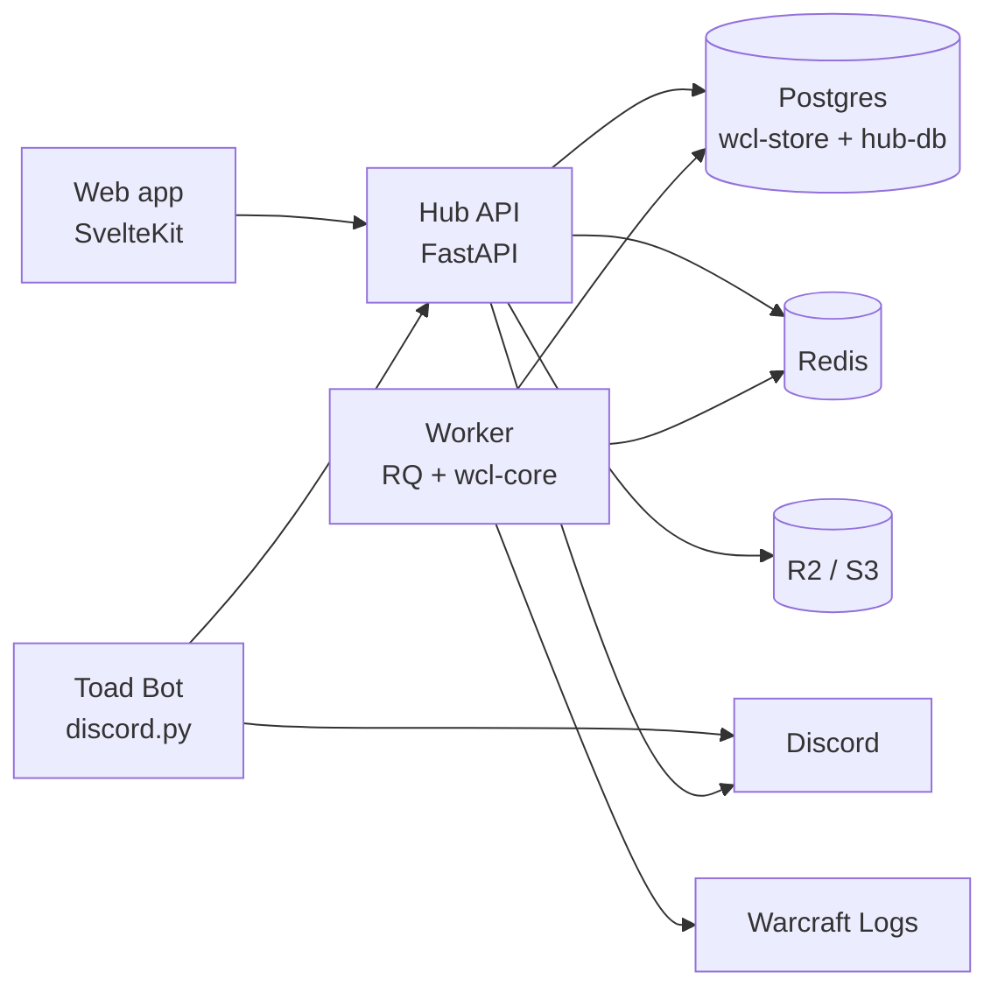

# Toads Hub

The Toads guild's web hub: log in with Discord, see how each raid went for you against the guild's
median for your role, browse raids and screenshots, and request items from the guild bank.

Built on the WCL Analyzer (`lgriffin/warcraftlogs_project`): the worker runs `wcl-core` analysis and
the API reads through `wcl-store`, the same code the desktop app and CLI use.



## Quick start

Needs Docker, [uv](https://docs.astral.sh/uv/), Node 22 and [just](https://just.systems/).

```bash
just setup
just test
just up        # http://localhost:8080
```

`just up` copies each service's `.env.example` to `.env` and `config/raid_days.example.yaml` to
`config/raid_days.yaml`; fill in Discord and Warcraft Logs credentials there.

## Status

Phase 2.0 (Foundations) scaffold:

| Piece | State |
|---|---|
| API | App factory, `/healthz`, OpenAPI at `/api/docs`, RBAC permissions + three-tier raid-day scoping with matrix tests, fail-fast settings, non-echoing validation errors |
| Worker | Report code / URL validation (fuzzed), sync diff, RQ entry point |
| Bot | discord.py client with single-guild command sync |
| hub-db | `members`, `character_claims`, `audit` |
| Web | Public Story, Recruit and Highlights pages; inward Hub (posts feed, raid leader desk), Officers console, Raids & Logs, Bank and Me. Sample data in the Pages preview |
| Community | Applications with private Discord interview rooms, officer posts curated both ways with Discord, highlight reels, consent-gated spotlights. In-memory until the 2.1 migrations; tables are in hub-db |
| Requirements | 105 EARS scenarios; 20 implemented (community layer, Pages preview); `docs/requirements.md` generated |
| CI | Lint, mypy strict, tests, coverage 80, security tests, pip-audit, npm audit, gitleaks, Playwright e2e with axe, image builds |

Next, per the phased plan: Alembic migrations and wcl-store tables (waits on the analyzer publishing
`wcl-core` / `wcl-store`), fake Discord OAuth server and seed data for `just seed`, then Discord login (H2).

See [SECURITY.md](SECURITY.md) and [docs/requirements.md](docs/requirements.md).
