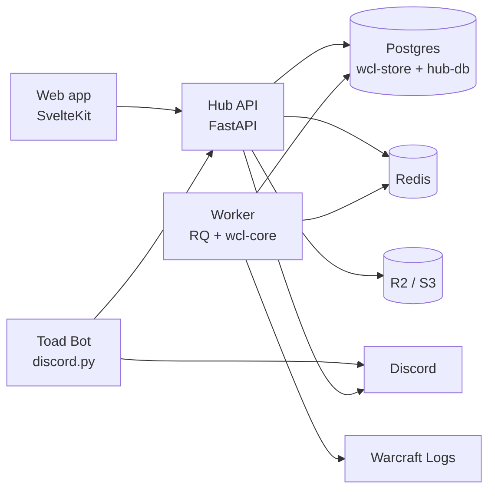

# Toads Hub

The Toads guild's web hub: log in with Discord, see how each raid went for you against the guild's
median for your role, browse raids and screenshots, and request items from the guild bank.

Built on the WCL Analyzer (`lgriffin/warcraftlogs_project`): the worker runs `wcl-core` analysis and
the API reads through `wcl-store`, the same code the desktop app and CLI use.



## Quick start

Needs Docker, [uv](https://docs.astral.sh/uv/), Node 22 and [just](https://just.systems/).

```bash
just setup
just test
just up        # http://localhost:8080
```

`just up` copies each service's `.env.example` to `.env` and `config/raid_days.example.yaml` to
`config/raid_days.yaml`. The API's example env signs in through the fake Discord server on
http://localhost:8081, so login works with no Discord application; fill in real Discord and Warcraft Logs
credentials there when you have them.

## Status

Phase 2.0 (Foundations) scaffold plus phase 2.2 (Identity and RBAC):

| Piece | State |
|---|---|
| API | App factory, `/healthz`, OpenAPI at `/api/docs`, fail-fast settings, non-echoing validation errors; Discord OAuth2 + PKCE login, Redis sessions with 15-minute role refresh, RBAC with raid-day scoping and a route-generated matrix test, character claims with officer approve/reject/reassign, members directory, audit log, startup check of configured Discord roles |
| Fake Discord | `toads_api.testing.fake_discord`: OAuth2 + member/roles endpoints for tests and the dev stack (no Discord app needed) |
| Guild bank | `toads_api.bank`: the hub's adapter to ToadsBank (sources, inventory, requests, paste imports, events to the `bank` bot); `toads_api.testing.fake_bank` stands in for ToadsBank in tests and the dev stack. See [docs/bank.md](docs/bank.md); super admins, the break-glass admin and officer tokens in [docs/admin.md](docs/admin.md) |
| Worker | Report code / URL validation (fuzzed), sync diff, RQ entry point; on-demand analysis through wcl-app's `RaidService` (saved role overrides apply) stored in wcl-store's Postgres tables, migrated by `toads-worker-migrate` |
| Bot | discord.py client with single-guild command sync |
| hub-db | `members`, `character_claims`, `audit`, community tables, Alembic migrations (`hub-db-migrate`) |
| Web | Public Story, Recruit and Highlights pages; inward Hub (posts feed, raid leader desk), Officers console, Raids & Logs, Bank and Me; Discord sign-in/out, members-only page, claim flow placeholder. Sample data in the Pages preview |
| Community | Applications with private Discord interview rooms, officer posts curated both ways with Discord, highlight reels, consent-gated spotlights. Stored in the hub database (hub-db migrations 0002, 0003); zone progress waits on wcl-store |
| Requirements | EARS scenarios from the build spec plus phase 2.2 and the community layer; `docs/requirements.md` generated with the counts |
| CI | Lint, mypy strict, import layering, tests, coverage 80, security tests, pip-audit, npm audit, gitleaks, Playwright e2e with axe, image builds |

Next, per the phased plan: the API reading wcl-store's tables and the character list the claim flow picks from
(until then `POST /api/claims` answers 404), the bot draining the
`#officers` outbox, and seed data for `just seed`.

See [SECURITY.md](SECURITY.md) and [docs/requirements.md](docs/requirements.md).
